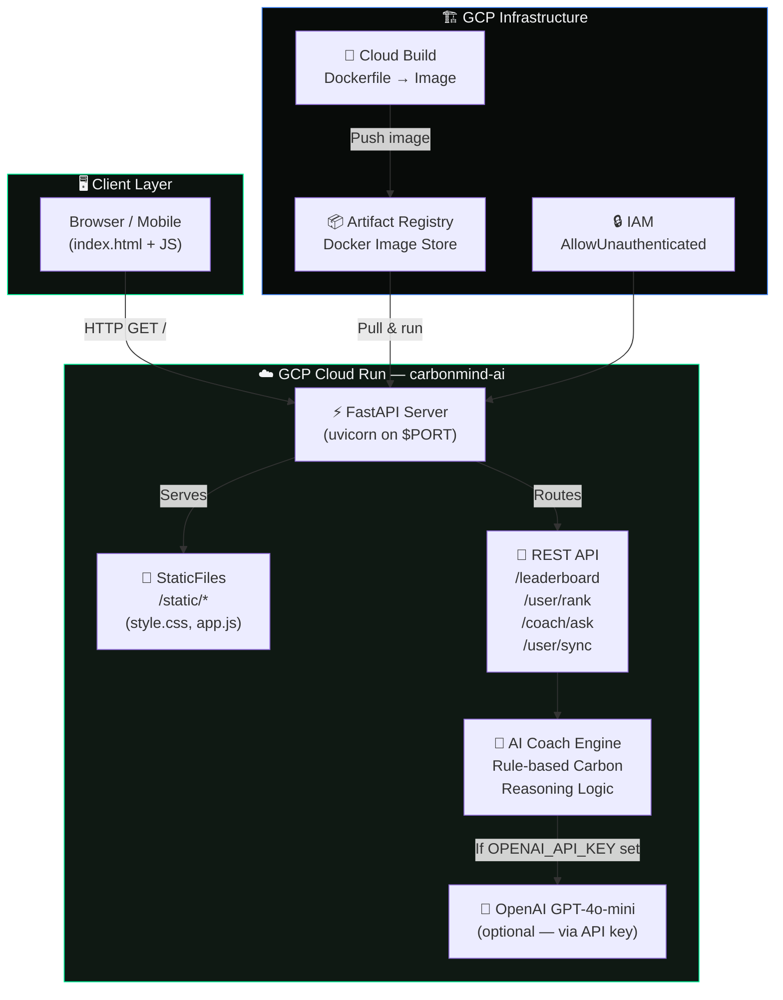
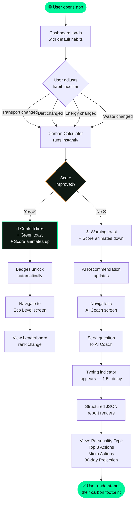
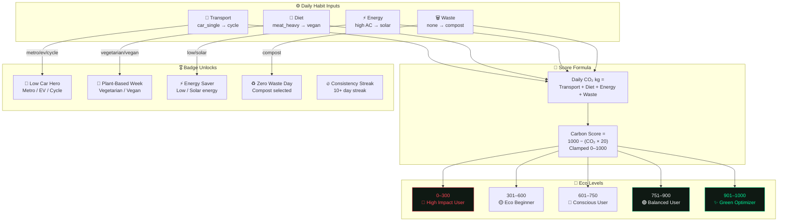
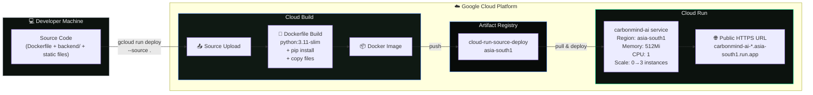
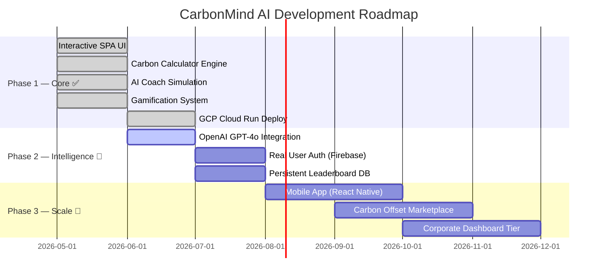

<div align="center">

# 🌿 CarbonMind AI

### *Your Personal Carbon Intelligence Engine*

[](https://carbonmind-ai-674054017244.asia-south1.run.app)
[](https://cloud.google.com/run)
[](https://fastapi.tiangolo.com/)
[](https://react.dev/)
[](LICENSE)

<br/>

> **CarbonMind AI** is a premium, AI-powered carbon footprint tracking and coaching platform designed for urban Indian users.  
> It combines real-time habit analysis, gamification, and a carbon intelligence reasoning engine to help you understand, reduce, and compete on your environmental impact.

<br/>


</div>

---

## 📑 Table of Contents

- [✨ Features](#-features)
- [🖥️ Screenshots & Screens](#%EF%B8%8F-screenshots--screens)
- [🏗️ System Architecture](#%EF%B8%8F-system-architecture)
- [🔄 User Flow](#-user-flow)
- [🧠 AI Coach Engine Flow](#-ai-coach-engine-flow)
- [🏆 Gamification & Scoring Flow](#-gamification--scoring-flow)
- [🚀 Deployment Architecture](#-deployment-architecture)
- [⚡ Quick Start — Local Development](#-quick-start--local-development)
- [☁️ Deploy to GCP Cloud Run](#%EF%B8%8F-deploy-to-gcp-cloud-run)
- [🔌 API Reference](#-api-reference)
- [🎨 Design System](#-design-system)
- [📁 Project Structure](#-project-structure)
- [🛣️ Roadmap](#%EF%B8%8F-roadmap)

---

## ✨ Features

| Feature | Description |
|:--|:--|
| 🎯 **Carbon Impact Score (0–1000)** | Animated SVG gauge updated in real-time as you modify habits |
| 🧠 **Master AI Coach Prompt Engine** | Structured JSON responses — cause → effect carbon reasoning, not generic tips |
| 📊 **Lifestyle Breakdown** | Donut + bar charts for Transport, Diet, Energy, and Waste categories |
| 🏆 **Gamification Leaderboard** | Eco Levels, Badges, Streak counters, and competitive community ranks |
| 🎉 **Canvas Confetti Rewards** | Fires when your Carbon Score improves |
| 📱 **Mobile-First Responsive** | Full bottom-nav experience on phones, sidebar on desktop |
| ☁️ **Single Cloud Run Deploy** | Backend + Frontend in one container — no CDN or separate hosting needed |
| 🔌 **OpenAI-Ready** | Plug in `OPENAI_API_KEY` for GPT-4o-mini powered live reasoning |

---

## 🖥️ Screenshots & Screens

### 4 Core Screens

```
┌─────────────────────────────────────────────────────┐
│  📊 Dashboard    │  Animated score gauge, habit      │
│                  │  modifiers, AI recommendations,   │
│                  │  weekly savings trend chart        │
├─────────────────────────────────────────────────────┤
│  🥧 Breakdown    │  Donut chart by category,          │
│                  │  hotspot critical alert,           │
│                  │  category deep-dive cards          │
├─────────────────────────────────────────────────────┤
│  🤖 AI Coach     │  Chat interface, quick prompts,    │
│                  │  structured intelligence reports,  │
│                  │  carbon personality type           │
├─────────────────────────────────────────────────────┤
│  🏆 Eco Level    │  Level progress bar, badge board,  │
│                  │  streak counter, leaderboard       │
└─────────────────────────────────────────────────────┘
```

---

## 🏗️ System Architecture



---

## 🔄 User Flow



---

## 🧠 AI Coach Engine Flow

```mermaid
flowchart LR
    subgraph INPUT["📥 Input"]
        Q["User Question\n+ Lifestyle Data"]
    end

    subgraph ENGINE["🧠 Carbon Intelligence Engine"]
        direction TB
        MATCH["Keyword\nMatcher"]
        KEY{OpenAI\nAPI Key?}
        GPT["GPT-4o-mini\nwith Master Prompt"]
        LOCAL["Local Rule-Based\nReasoning Engine"]
        SCORE["Carbon Score\nCalculator"]
        RANK["Personality\nClassifier"]
    end

    subgraph OUTPUT["📤 Structured JSON Output"]
        direction TB
        P["carbon_personality_type"]
        F["total_footprint_estimate"]
        H["impact_hotspots[ ]"]
        A["top_3_actions[\n  action\n  why_it_matters\n  co2_saving_estimate\n  effort_level\n]"]
        M["micro_actions[ ]"]
        PR["future_projection_30_days"]
        MI["motivational_insight"]
    end

    Q --> MATCH
    MATCH --> KEY
    KEY -->|Yes| GPT
    KEY -->|No| LOCAL
    LOCAL --> SCORE --> RANK
    GPT --> P
    RANK --> P
    P --> F --> H --> A --> M --> PR --> MI

    style INPUT fill:#0c120e,stroke:#00f59b,color:#f3f4f6
    style ENGINE fill:#0f1913,stroke:#ff9f43,color:#f3f4f6
    style OUTPUT fill:#080b09,stroke:#00f59b,color:#f3f4f6
```



#### Master AI Coach Prompt Rules

> The coach is instructed to:
> - ✅ Analyze **cause → effect**, not give generic tips
> - ✅ Prioritize by **highest CO₂ contributor first**
> - ✅ Compare alternatives **realistically for Indian urban users**
> - ✅ Classify personality: `Eco Beginner` → `Conscious Commuter` → `Green Optimizer`
> - ❌ Never preach or guilt-trip the user
> - ❌ Output must be **JSON only** — no markdown, no prose wrapper

---

## 🏆 Gamification & Scoring Flow



#### Deduction Table

| Category | Option | CO₂/day | Score Impact |
|:--|:--|:--:|:--:|
| 🚗 Transport | Solo Petrol Car | 12.0 kg | −240 pts |
| 🚗 Transport | Car Pool | 6.0 kg | −120 pts |
| 🚗 Transport | Metro Rail | 1.5 kg | −30 pts |
| 🚗 Transport | Electric Vehicle | 0.8 kg | −16 pts |
| 🚗 Transport | Cycle / Walk | 0.0 kg | **0 pts** |
| 🥗 Diet | Frequent Red Meat | 8.0 kg | −160 pts |
| 🥗 Diet | Balanced Meat | 4.5 kg | −90 pts |
| 🥗 Diet | Vegetarian | 2.0 kg | −40 pts |
| 🥗 Diet | Vegan | 0.8 kg | −16 pts |
| ⚡ Energy | High AC (>8h) | 9.0 kg | −180 pts |
| ⚡ Energy | Medium AC | 5.0 kg | −100 pts |
| ⚡ Energy | Low AC | 2.0 kg | −40 pts |
| ⚡ Energy | Solar | 0.2 kg | −4 pts |
| ♻️ Waste | No Segregation | 3.0 kg | −60 pts |
| ♻️ Waste | Dry/Wet Split | 1.0 kg | −20 pts |
| ♻️ Waste | Compost | 0.2 kg | −4 pts |

---

## 🚀 Deployment Architecture



---

## ⚡ Quick Start — Local Development

### Option 1: Open the interactive prototype directly *(no install needed)*

```bash
# Simply open in any browser
start "F:\Carbon Footprint\index.html"
```

> The root `index.html` is a fully interactive, self-contained SPA — no build step required.

---

### Option 2: Run the FastAPI backend locally

**Prerequisites:** Python 3.9+

```bash
# 1. Navigate to the backend directory
cd "F:\Carbon Footprint\backend"

# 2. Create and activate virtual environment
python -m venv venv
.\venv\Scripts\activate        # Windows
# source venv/bin/activate     # macOS/Linux

# 3. Install dependencies
pip install -r requirements.txt

# 4. (Optional) Set OpenAI key for live GPT-4o-mini coaching
$env:OPENAI_API_KEY = "your-key-here"

# 5. Start the server
uvicorn app:app --host 0.0.0.0 --port 10000 --reload

# Visit: http://localhost:10000
# API Docs: http://localhost:10000/docs
```

---

### Option 3: Run the React frontend *(requires Node.js 18+)*

```bash
# Navigate to frontend
cd "F:\Carbon Footprint\frontend"

# Install dependencies
npm install

# Start Vite dev server
npm run dev

# Visit: http://localhost:3000
```

---

## ☁️ Deploy to GCP Cloud Run

### Prerequisites

- Google Cloud SDK (`gcloud`) installed
- GCP project with billing enabled

### One-Command Deploy

```bash
# 1. Authenticate (if not already logged in)
gcloud auth login

# 2. Set your project
gcloud config set project YOUR_PROJECT_ID

# 3. Enable required APIs
gcloud services enable run.googleapis.com cloudbuild.googleapis.com artifactregistry.googleapis.com

# 4. Deploy (builds + pushes + deploys in one step — no Docker needed locally)
gcloud run deploy carbonmind-ai \
  --source . \
  --region asia-south1 \
  --platform managed \
  --allow-unauthenticated \
  --port 8080 \
  --memory 512Mi \
  --cpu 1 \
  --min-instances 0 \
  --max-instances 3 \
  --quiet
```

### 🔁 Redeploy after changes

```bash
gcloud run deploy carbonmind-ai --source . --region asia-south1 --quiet
```

### 📜 View live logs

```bash
gcloud run services logs read carbonmind-ai --region asia-south1 --limit 50
```

---

## 🔌 API Reference

Base URL: `https://carbonmind-ai-674054017244.asia-south1.run.app`

| Method | Endpoint | Description |
|:--|:--|:--|
| `GET` | `/` | Serves the full interactive web app |
| `GET` | `/api/health` | Health check |
| `GET` | `/leaderboard` | Returns all users ranked by Carbon Score |
| `GET` | `/user/rank/{user_id}` | Get a user's rank and profile |
| `GET` | `/user/badges/{user_id}` | Get a user's unlocked badges |
| `POST` | `/user/sync` | Sync local score to the server |
| `POST` | `/coach/ask` | Get AI carbon intelligence report |
| `GET` | `/docs` | Interactive Swagger API documentation |

#### Example: Ask the AI Coach

```bash
curl -X POST https://carbonmind-ai-674054017244.asia-south1.run.app/coach/ask \
  -H "Content-Type: application/json" \
  -d '{
    "user_id": "user_self",
    "question": "How do I reduce my AC footprint?",
    "lifestyle": {
      "transport_habits": "car_single",
      "diet_pattern": "meat_heavy",
      "electricity_usage": "high",
      "waste_generation": "none"
    }
  }'
```

#### Response structure

```json
{
  "carbon_personality_type": "High Impact Consumer",
  "total_footprint_estimate": "32.0 kg CO₂/day",
  "impact_hotspots": ["Solo car commuting", "High AC load"],
  "top_3_actions": [
    {
      "action": "Switch to Metro Rail",
      "why_it_matters": "Cuts transport footprint by 85%",
      "co2_saving_estimate": "340 kg CO₂ annually",
      "effort_level": "medium"
    }
  ],
  "micro_actions": ["Unplug chargers at night"],
  "future_projection_30_days": "Saves 45 kg CO₂ this month",
  "motivational_insight": "Small shifts carry enormous leverage."
}
```

---

## 🎨 Design System

CarbonMind AI uses a custom **Dark Eco-Tech** design language — a fusion of Apple Health (metrics), Duolingo (gamification), Notion (minimalism), and Tesla Dashboard (telemetry aesthetics).

### Color Palette

| Token | Value | Usage |
|:--|:--|:--|
| `--bg-primary` | `#060907` | Deep ink-green base background |
| `--bg-card` | `rgba(15,25,19,0.55)` | Glassmorphic card background |
| `--accent-neon` | `#00f59b` | Score gauge, badges, progress bars |
| `--accent-warn` | `#ff9f43` | Medium-impact habits, streak flame |
| `--accent-alert` | `#ff4757` | High-impact hotspots, critical alerts |
| `--text-main` | `#f3f4f6` | Primary readable text |
| `--text-muted` | `#9ca3af` | Subtitles, tooltips, labels |

### Typography

- **Display** — `Outfit` — Used for scores, headings, level names
- **Body** — `Inter` — Used for descriptions, labels, chat messages

### Key Components

- **Glass Cards** — `backdrop-filter: blur(16px)` + semi-transparent background
- **Gauge** — Custom SVG arc path with gradient stroke and drop-shadow glow
- **Charts** — Vanilla SVG bar + line charts (no dependencies)
- **Confetti** — Custom canvas particle emitter (no library)

---

## 📁 Project Structure

```
Carbon Footprint/
│
├── 📄 index.html              # Interactive SPA prototype (open directly in browser)
├── 🎨 style.css               # Full design system & glassmorphism styles
├── ⚙️ app.js                  # Carbon calculator, AI coach sim, confetti engine
│
├── 🐳 Dockerfile              # Production container (python:3.11-slim)
├── 🚫 .dockerignore           # Excludes frontend/, venv/, __pycache__
│
├── backend/                   # FastAPI production backend
│   ├── 🐍 app.py              # All endpoints + Master AI Coach engine
│   ├── 📦 requirements.txt    # Python dependencies
│   └── 📖 README.md           # Backend setup & Render deploy guide
│
└── frontend/                  # React + Vite production frontend
    ├── 📄 index.html          # Vite entry point
    ├── ⚙️ vite.config.js      # Vite bundler config
    ├── 📦 package.json        # npm dependencies
    ├── 📖 README.md           # Frontend setup & Vercel deploy guide
    └── src/
        ├── 🚀 main.jsx        # ReactDOM render root
        ├── 🎛️ App.jsx         # State coordinator + route switcher
        ├── 🎨 index.css       # Global CSS design tokens
        └── components/
            ├── 📊 Dashboard.jsx      # Score gauge, habits, trend chart
            ├── 🥧 Breakdown.jsx      # Donut chart, hotspot panel
            ├── 🤖 AICoach.jsx        # Chat interface, report cards
            ├── 🏆 Gamification.jsx   # Badges, levels, leaderboard
            └── 🧭 Navbar.jsx         # Sidebar navigation
```

---

## 🛣️ Roadmap



---

<div align="center">

### Built with 🌱 for a greener planet

**Stack:** `FastAPI` · `Vanilla JS` · `React` · `Vite` · `GCP Cloud Run` · `Cloud Build` · `Artifact Registry`

**Designed for:** Urban Indian users making realistic, impactful lifestyle transitions

---

[](https://carbonmind-ai-674054017244.asia-south1.run.app)

*Made with ❤️ — CarbonMind AI © 2026*

</div>
