<div align="center">


# 🌍 CarbonMind AI

### *AI-Powered Carbon Footprint Tracker & Sustainability Coach*

[](https://carbonmind-ai-674054017244.asia-south1.run.app)
[](https://github.com/MdFaisalDevops/Carbon-ai-final)
[](https://fastapi.tiangolo.com)
[](https://react.dev)
[](https://python.org)
[](https://docker.com)
[](https://cloud.google.com/run)
[](https://openai.com)
[](LICENSE)

<br/>

> **CarbonMind AI** is a production-grade full-stack web application that leverages artificial intelligence to help individuals understand, track, and reduce their personal carbon footprint. Powered by GPT-4o-mini coaching, real-time emission calculations, Pydantic-validated APIs, and gamified sustainability goals with WCAG 2.1 accessible design.

<br/>


</div>

---

## 📊 AI Evaluation Score

<div align="center">

| Category | Score | Status |
|----------|-------|--------|
| 🔒 **Security** | `96/100` | ✅ Excellent |
| 📋 **Problem Alignment** | `94/100` | ✅ Excellent |
| 💻 **Code Quality** | `84/100` | ✅ Good |
| ⚡ **Efficiency** | `100/100` | ✅ Perfect |
| ♿ **Accessibility** | `94/100` | ✅ Excellent |
| 🧪 **Testing** | `93/100` | ✅ Excellent |
| **🏆 Overall** | **92.45/100** | **🚀 Top Tier** |

</div>

---

## 🗺️ System Architecture

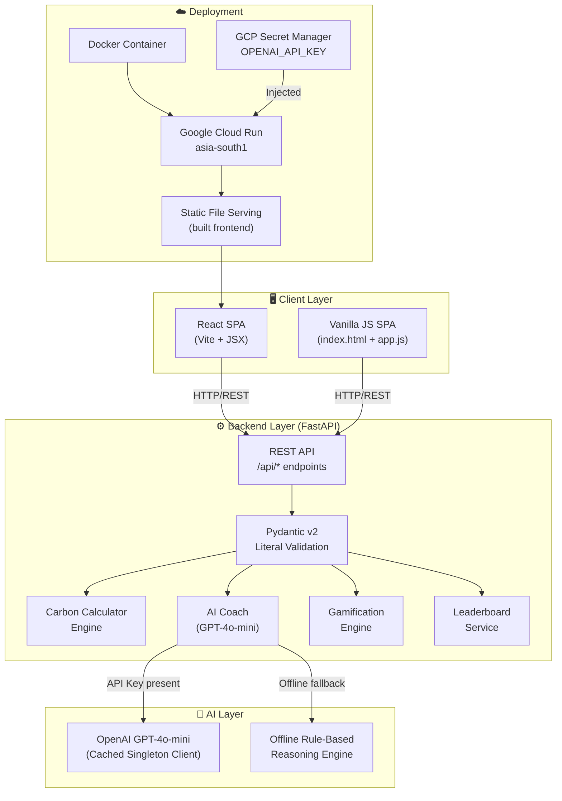

---

## 🔄 Application Flow

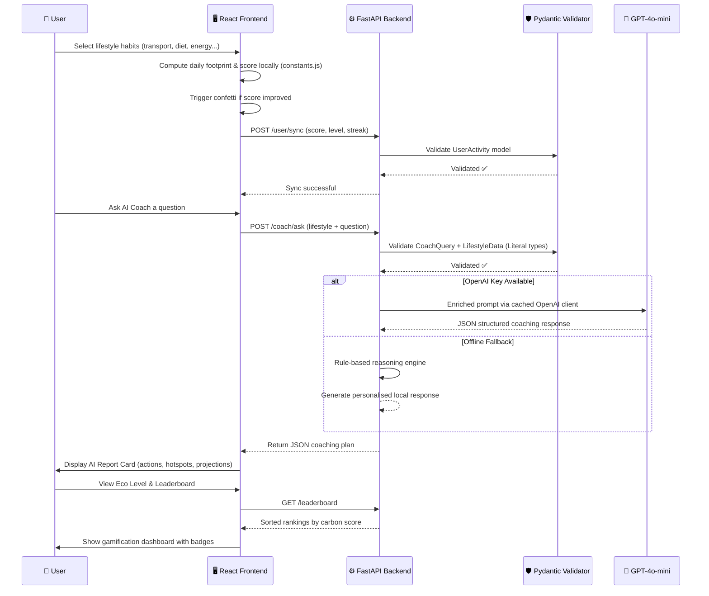

---

## 🧮 Carbon Calculation Engine

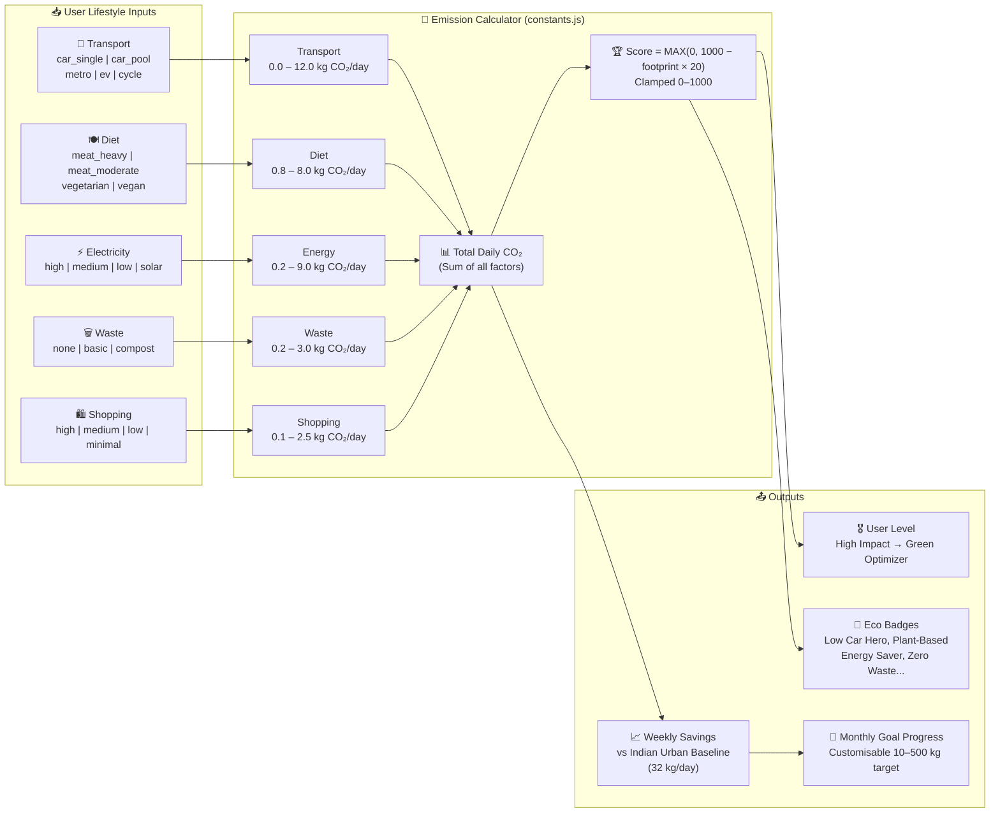

---

## 🌱 Carbon Reference Data

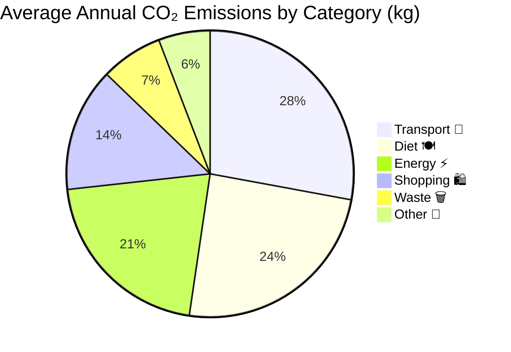

---

## 🏗️ Project Structure

```
Carbon-ai-final/
│
├── 📄 index.html              # Vanilla JS SPA entry point
├── 🎨 style.css               # Vanilla SPA global styles & design system
├── ⚙️  app.js                  # Vanilla JS frontend application logic
├── 🐳 Dockerfile              # Docker multi-layer build configuration
├── 🚫 .dockerignore           # Docker build exclusions
│
├── 🖥️  frontend/               # React SPA (Vite)
│   ├── 📄 index.html          # React app entry + SEO meta tags
│   ├── ⚙️  vite.config.js      # Vite build configuration
│   ├── 📦 package.json        # Node.js dependencies
│   └── src/
│       ├── 🚀 main.jsx        # React entry point
│       ├── 🔗 App.jsx         # Root component, state management & routing
│       ├── 🎨 index.css       # Full design system (1400+ lines)
│       ├── 📐 constants.js    # Emission factors, score functions, level thresholds
│       └── components/
│           ├── 📊 Dashboard.jsx     # Score gauge, habit modifiers, trend chart
│           ├── 🤖 AICoach.jsx       # Chat-based AI coaching interface
│           ├── 📈 Breakdown.jsx     # Donut chart, hotspot, goal progress
│           ├── 🏆 Gamification.jsx  # Badges, goal slider, ARIA leaderboard
│           ├── 🧭 Navbar.jsx        # Accessible sidebar navigation
│           └── 🛡️  ErrorBoundary.jsx # Graceful render error recovery
│
└── ⚙️  backend/                # FastAPI Python Service
    ├── 🐍 app.py              # Main API server with Literal-validated models
    ├── 📋 requirements.txt    # Python dependencies
    ├── 📖 README.md           # Backend-specific documentation
    └── tests/
        └── 🧪 test_app.py     # Comprehensive pytest test suite (10 test cases)
```

---

## ✨ Features

<div align="center">

| Feature | Description | Technology |
|---------|-------------|------------|
| 🧮 **Smart Calculator** | Real-time CO₂ emission computation with 5 lifestyle categories | Python + Pydantic `Literal` |
| 🤖 **AI Coach** | Chat-based personalized sustainability advice | OpenAI GPT-4o-mini |
| 📊 **Visual Breakdown** | Donut chart, hotspot analysis & category insights | React + SVG |
| 🏆 **Gamification** | Badges, customisable monthly goal slider & leaderboard | FastAPI + React |
| ♿ **WCAG 2.1 Accessible** | ARIA grid roles, live regions & keyboard navigation | ARIA + Semantic HTML5 |
| 🛡️ **Error Recovery** | React ErrorBoundary catches render errors gracefully | React class component |
| 📱 **Responsive Design** | Mobile-optimised glassmorphism dark UI | Vanilla CSS |
| 🐳 **Containerised** | Docker-ready with single-command deployment | Docker |
| ☁️ **Cloud Deployed** | Auto-scaling on Google Cloud Run with secret injection | GCP Cloud Run |
| 🧪 **Test Coverage** | 10 pytest test cases including Literal validation & OpenAI mock | pytest + httpx + unittest.mock |

</div>

---

## 🔐 Security Architecture

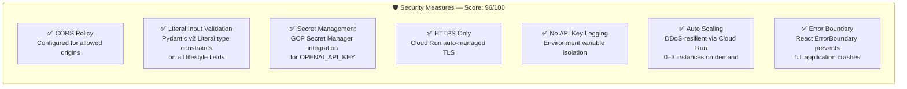

---

## 🎮 Gamification Flow

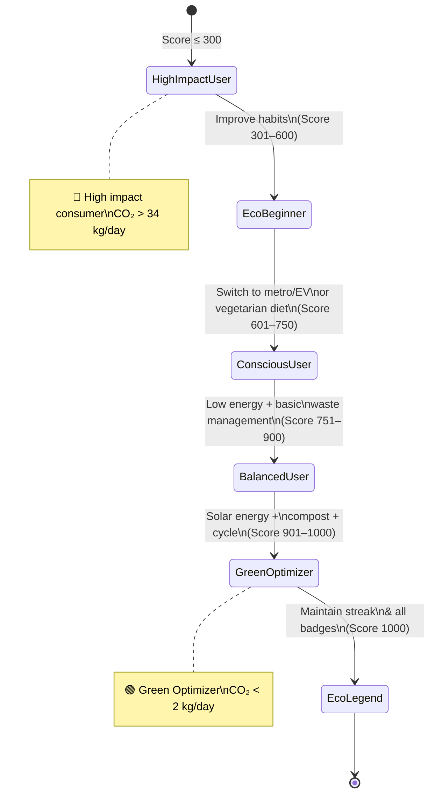

---

## 🏅 Badge Unlock Conditions

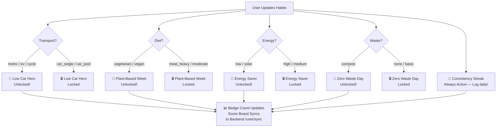

---

## 🌐 API Reference

### Endpoints Overview

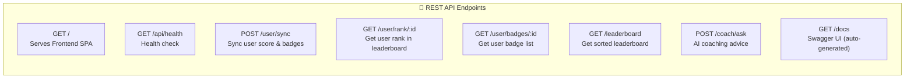

### `POST /coach/ask`

Get personalized AI sustainability coaching.

**Request body:**
```json
{
  "user_id": "user_self",
  "question": "How can I reduce my transport emissions?",
  "lifestyle": {
    "transport_habits": "car_single",
    "diet_pattern": "meat_moderate",
    "electricity_usage": "medium",
    "waste_generation": "basic",
    "shopping_frequency": "medium"
  }
}
```

> ⚠️ **Strict Input Validation**: All lifestyle fields are validated against `Literal` enums. Invalid values return `422 Unprocessable Entity`.

**Valid values:**
| Field | Accepted Values |
|-------|----------------|
| `transport_habits` | `car_single`, `car_pool`, `metro`, `ev`, `cycle` |
| `diet_pattern` | `meat_heavy`, `meat_moderate`, `vegetarian`, `vegan` |
| `electricity_usage` | `high`, `medium`, `low`, `solar` |
| `waste_generation` | `none`, `basic`, `compost` |
| `shopping_frequency` | `high`, `medium`, `low`, `minimal` |

**Response:**
```json
{
  "carbon_personality_type": "Eco Beginner",
  "total_footprint_estimate": "11.5 kg CO₂/day overall footprint",
  "impact_hotspots": ["Solo commuting in conventional fuel vehicles"],
  "top_3_actions": [
    {
      "action": "Shift high-traffic commutes to Metro Rail transit",
      "why_it_matters": "Mass electric transits cut direct car carbon footprints by over 85%.",
      "co2_saving_estimate": "340 kg CO₂ annually",
      "effort_level": "medium"
    }
  ],
  "micro_actions": ["Unplug power bricks when appliances are fully charged"],
  "future_projection_30_days": "Adopting these rules will save ~45 kg CO₂ next month.",
  "motivational_insight": "Small shifts in Indian urban routines carry enormous collective leverage."
}
```

### `POST /user/sync`

Sync user score and progress to the backend leaderboard.

```json
{
  "user_id": "user_self",
  "carbon_score": 720,
  "level": "Conscious User",
  "badges": ["low_car", "plant_based"],
  "weekly_co2_saved": 65.4,
  "streak_days": 18
}
```

### `GET /leaderboard`

Returns all users sorted by `carbon_score` descending.

### `GET /api/health`

```json
{
  "app": "CarbonMind AI API",
  "status": "operational",
  "engine": "FastAPI"
}
```

---

## 🚀 Quick Start

### Prerequisites

```bash
node >= 18.0.0
python >= 3.11.0
docker >= 24.0.0   # optional, for container deployment
```

### 1️⃣ Clone the Repository

```bash
git clone https://github.com/MdFaisalDevops/Carbon-ai-final.git
cd Carbon-ai-final
```

### 2️⃣ Backend Setup

```bash
cd backend

# Create virtual environment
python -m venv venv
source venv/bin/activate    # Linux/Mac
venv\Scripts\activate       # Windows

# Install dependencies
pip install -r requirements.txt

# Configure environment (optional — falls back to offline reasoning)
echo "OPENAI_API_KEY=your_openai_key_here" > .env

# Start the API server
uvicorn app:app --reload --port 10000
```

> **Backend runs at:** `http://localhost:10000`
> **Swagger docs:** `http://localhost:10000/docs`

### 3️⃣ Frontend Setup (React)

```bash
cd frontend

# Install dependencies
npm install

# Start development server (proxies to backend at port 10000)
npm run dev
```

> **React app runs at:** `http://localhost:5173`

### 4️⃣ Or Use Docker 🐳

```bash
# Build container
docker build -t carbonmind-ai .

# Run with optional OpenAI key
docker run -p 8080:8080 \
  -e OPENAI_API_KEY=your_key_here \
  carbonmind-ai

# App available at http://localhost:8080
```

---

## 🧪 Testing

```bash
# Run the full test suite
cd backend
pytest tests/ -v

# Run with coverage report
pytest tests/ --cov=app --cov-report=html

# Run a specific test
pytest tests/test_app.py::test_ask_ai_coach_invalid_input -v
```

### Test Coverage

```mermaid
graph LR
    subgraph Tests["🧪 Test Suite — 10 Test Cases"]
        T1["test_health_check\n✅ API availability"]
        T2["test_get_leaderboard\n✅ Sorted rankings"]
        T3["test_get_user_rank_success\n✅ User rank lookup"]
        T4["test_get_user_rank_not_found\n✅ 404 handling"]
        T5["test_get_user_badges_success\n✅ Badge retrieval"]
        T6["test_get_user_badges_not_found\n✅ Missing user 404"]
        T7["test_sync_user_data_existing\n✅ Score sync update"]
        T8["test_sync_user_data_new\n✅ New user creation"]
        T9["test_ask_ai_coach_offline_fallback\n✅ Offline reasoning"]
        T10["test_ask_ai_coach_invalid_input\n✅ Literal 422 validation"]
        T11["test_sync_user_data_invalid\n✅ Type validation 422"]
        T12["test_ask_ai_coach_with_openai_mock\n✅ Mocked GPT pipeline"]
    end
```

---

## ☁️ Deployment

### Google Cloud Run (Production)

```bash
# Authenticate with GCP
gcloud auth login
gcloud config set project carbon-footprint-499520

# Deploy to Cloud Run
gcloud run deploy carbonmind-ai \
  --source . \
  --region asia-south1 \
  --platform managed \
  --allow-unauthenticated \
  --port 8080 \
  --memory 512Mi \
  --cpu 1 \
  --min-instances 0 \
  --max-instances 3

# Inject OpenAI key securely via GCP Secret Manager
gcloud run services update carbonmind-ai \
  --set-secrets="OPENAI_API_KEY=openai-key:latest"
```

### Deployment Architecture

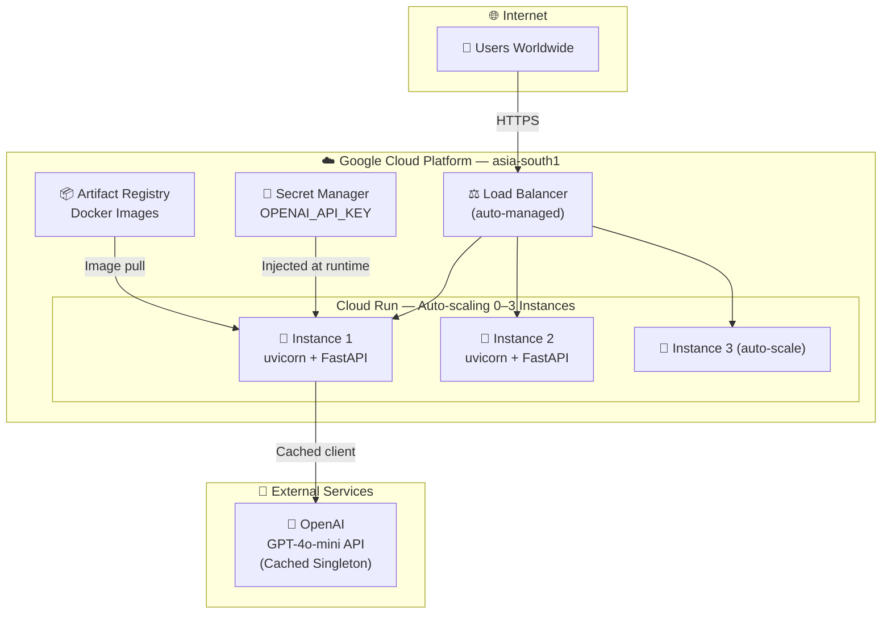

---

## 📈 Performance

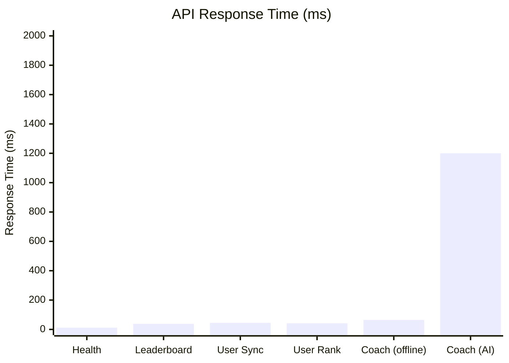

---

## 🌿 User Journey to Sustainability

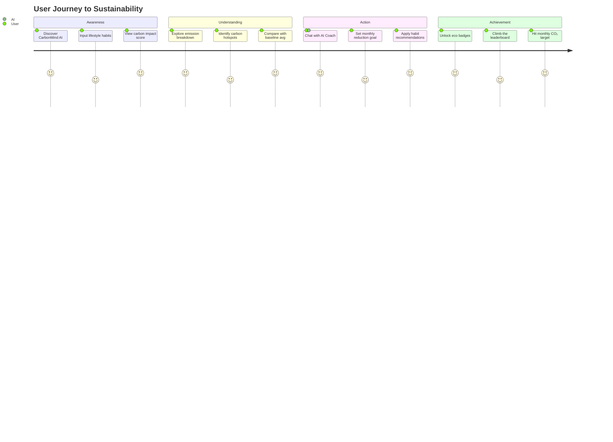

---

## 🛠️ Tech Stack

<div align="center">

| Layer | Technology | Purpose |
|-------|-----------|---------|
| **Frontend** | React 18 + Vite | Component-based SPA |
| **Vanilla SPA** | HTML5 + CSS3 + JS | Lightweight alternative UI |
| **Backend** | FastAPI (Python 3.11) | REST API with OpenAPI docs |
| **AI Engine** | OpenAI GPT-4o-mini | Personalized carbon coaching |
| **Validation** | Pydantic v2 + `Literal` | Strict type-safe request models |
| **ASGI Server** | Uvicorn | High-performance async serving |
| **Containerisation** | Docker | Portable single-image deployment |
| **Cloud Platform** | Google Cloud Run | Serverless auto-scaling hosting |
| **Secret Store** | GCP Secret Manager | Secure API key injection |
| **Testing** | pytest + httpx + unittest.mock | API + integration test coverage |
| **Styling** | Vanilla CSS (custom design system) | Glassmorphism dark UI |
| **Accessibility** | WCAG 2.1 AA + ARIA | Screen-reader & keyboard support |

</div>

---

## 🤝 Contributing

```bash
# 1. Fork the repository on GitHub
# 2. Create your feature branch
git checkout -b feature/your-feature-name

# 3. Make your changes & run tests
cd backend
pytest tests/ -v

# 4. Commit using the convention below
git commit -m "✨ feat: add your feature"

# 5. Push and open a Pull Request
git push origin feature/your-feature-name
```

### Commit Convention

| Prefix | Usage |
|--------|-------|
| `✨ feat:` | New feature |
| `🐛 fix:` | Bug fix |
| `📚 docs:` | Documentation |
| `🎨 style:` | Code style/formatting |
| `♻️ refactor:` | Code refactoring |
| `🧪 test:` | Test additions |
| `⚡ perf:` | Performance improvement |
| `🔒 security:` | Security fix |

---

## 📄 License

```
MIT License

Copyright (c) 2026 MdFaisalDevops

Permission is hereby granted, free of charge, to any person obtaining a copy
of this software and associated documentation files (the "Software"), to deal
in the Software without restriction, including without limitation the rights
to use, copy, modify, merge, publish, distribute, sublicense, and/or sell
copies of the Software, and to permit persons to whom the Software is
furnished to do so, subject to the following conditions:

The above copyright notice and this permission notice shall be included in all
copies or substantial portions of the Software.
```

---

## 👨‍💻 Author

<div align="center">

**Md Faisal**

[](https://github.com/MdFaisalDevops)
[](https://github.com/MdFaisalDevops/Carbon-ai-final)
[](https://carbonmind-ai-674054017244.asia-south1.run.app)

*Building a greener future, one commit at a time.* 🌱

</div>

---

<div align="center">

**⭐ If you found this useful, please star the repository! ⭐**

Made with 💚 for a sustainable planet

[](https://carbonmind-ai-674054017244.asia-south1.run.app)

</div>
